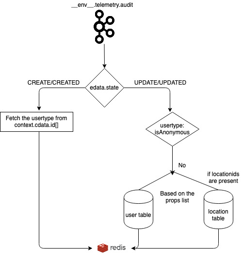

# \[Design]-Denormalise-User-Metadata

#### Problem Statement:

The two data products CourseMetricsJob and AssessmentMetricsJob depends on the user metadata which are generated on joining different tables from core cassandra and LP cassandra. The logic for joining the table and fetching the informations per user type is complex.

#### Solution 1:

We will be fetching the informations from cassandra table , compute all the required fields in the flink job (user-cache-updater job) and update all the fields to the redis cache.

#### Design for the fields to be fetched:

|    | **Field Name**    | **Type**                    | **Table Name** | **Description**                                                                  |
| -- | ----------------- | --------------------------- | -------------- | -------------------------------------------------------------------------------- |
| 1  | **User-ID**       | String                      | User           | It indicates user unique Identifier                                              |
| 2  | **Mobile Number** | String                      | User           | User phone number in an encrypted format                                         |
| 3  | **Email ID**      | String                      | User           | User mail id in an encrypted format                                              |
| 4  | ID                | String                      | User           | User unique identifier                                                           |
| 5  | First Name        | String                      | User           | User first name                                                                  |
| 6  | Last Name         | String                      | User           | User Last Name                                                                   |
| 7  | Phone Verified    | String                      | User           | It indicates whether user is verified the phone number or not                    |
| 8  | Email Verified    | String                      | User           | It indicates whether user is verified the email or not                           |
| 9  | Flags Value       | Int                         | User           |                                                                                  |
| 10 | Framework         | Map\[String, List\[String]] | User           | User framework                                                                   |
| 11 | Rootorgid         | String                      | User           | User root org id (can be used to differentiate between custodian and state user) |
| 12 | CreatedBy         | String                      | User           | User created By                                                                  |
| 13 | Subject           | List\[String]               | User           | User subjects                                                                    |
| 14 | Language          | List\[String]               | User           | User Language                                                                    |
| 15 | Grade             | List\[String]               | User           | User grades                                                                      |
| 16 | Roles             | List\[String]               | User           | User roles                                                                       |
| 17 | Status            | Int                         | User           | User status                                                                      |
| 18 | Webpages          | List\[Map\[String, String]] | User           |                                                                                  |
| 19 | Createddate       | String                      | User           | User created date                                                                |
| 20 | Emailverified     | Boolean                     | User           | User email is verified or not                                                    |
| 21 | Isdeleted         | Boolean                     | User           | User is deleted or not                                                           |
| 22 | Locationids       | List\[Strings]              | User           |                                                                                  |

1. If the user is **Self Signed Up (custodian) user** : USER.locationids
2. If the user is **state user:** ORGANISATION.locationids

\| | 23 | Updateddate | String | User | User last updated date | | 24 | Profilevisibility | String | User | User profile visibility | | 25 | Loginid | String | User | User login id | | 26 | **Username** | String | User | It’s a combination of user first name and last name columns | | 27 | **External-ID** | String | User\_external\_identity |

1. If the user is a **self signed up user in the custodian org** then the user’s self declared Teacher ID will be the value to the field.
   1. &#x20;Filter the User\_external\_identity.idtype='declared-ext-id'
   2. Join with ORG table with condition User\_external\_identity.provider=ORG.channel and fetch User\_external\_identity.userid , User\_external\_identity.externalID
2. If the user is a **state user** then the state provided External ID will be the value to the field.
   1. Join USER and User\_external\_identity table with User\_external\_identity.idType =User.channel and User\_external\_identity.provider=User.channel and fetch User\_external\_identity.userid , User\_external\_identity.externalID

\| | 28 | **School Name** | String | Custodian User: User\_external\_identity State User: Organisation |

1. If the user is **Self Signed Up (custodian) user** then user’s self declared School Information code will be the value to the field.
   1. User\_external\_identity.idtype='declared-school-name' anf fetch User\_external\_identity.externalid,userid
2. If the user is **state user** then state provided School Information will be the values.
   1. Join on User.userId = User\_org.userId and then on get User\_org.orgId and then join with [Organisation.id](http://organisation.id) where isRootOrg = false and fetch the Organisation.orgcode and ORG.orgname as school\_name

\| | 29 | **School UDISE Code** | String | Custodian User: User\_external\_identity State User: Organisation |

1. If the user is **Self Signed Up (custodian) user** then user’s self declared School Information code will be the value to the field.
   1. User\_external\_identity.idtype='declared-school-udise-code' and fetch User\_external\_identity.externalid,userid
2. If the user is **state user** then state provided School Information will be the values.
   1. Join on User.userId = User\_org.userId and then on get User\_org.orgId and then join with [ORGANISATION.id](http://organisation.id) where isRootOrg = false and fetch the ORGANISATION.orgcode and ORG.orgname as school\_name

\| | 30 | **State Name** | String | Location |

1. If the user is **Self Signed Up (custodian) user** then user’s self declared state will be the value to the field
   1. [USER.locationids=LOCATION.id](http://user.locationids=location.id) and LOCATION.type='state/' and fetch the name as LOCATION.{state\_name},USER.userid
2. If the user is **state user** then state value passed by the state system or derived from the teacher’s school ID will be the value to the field
   1. Join ORGANISATION and location table having condition: [ORG.locationids=Location.id](http://org.locationids=location.id) && Location.type='state and fetch the [Location.name](http://location.name), [ORG.id](http://org.id)
   2. Join the Dataframe given in (i) and user table with condition: [ORG.id](http://org.id) = USER.rootorgid && ORG.isrootorg=true and get the USER.userid, [Location.name](http://location.name)

\| | 31 | **District Name** | String | Location |

1. If the user is **Self Signed Up (custodian) user** then user’s self declared state will be the value to the field
   1. [USER.locationids=LOCATION.id](http://user.locationids=location.id) and LOCATION.type='district' and fetch the name as LOCATION.{district\_name},USER.userid
2. If the user is **state user** then state value passed by the state system or derived from the teacher’s school ID will be the value to the field
   1. Join ORGANISATION and location table having condition: [ORG.locationids=Location.id](http://org.locationids=location.id) && Location.type='district and fetch the [Location.name](http://location.name), [ORG.id](http://org.id)
   2. Join the Dataframe given in (i) and user table with condition: [ORG.id](http://org.id) = USER.rootorgid && ORG.isrootorg=true and get the USER.userid, [Location.name](http://location.name)

\| | 32 | **Block Name** | String | Location |

1. If the user is **Self Signed Up (custodian) user** then user’s self declared state will be the value to the field
   1. [USER.locationids=LOCATION.id](http://user.locationids=location.id) and LOCATION.type='block' and fetch the name as LOCATION.{block\_name},USER.userid
2. If the user is **state user** then state value passed by the state system or derived from the teacher’s school ID will be the value to the field
   1. Join ORGANISATION and location table having condition: [ORG.locationids=Location.id](http://org.locationids=location.id) && Location.type='block' and fetch the [Location.name](http://location.name), [ORG.id](http://org.id)
   2. Join the Dataframe given in (i) and user table with condition: [ORG.id](http://org.id) = USER.rootorgid && ORG.isrootorg=true and get the USER.userid, [Location.name](http://location.name)

|

***

\[\[category.storage-team]] \[\[category.confluence]]
